# Project Overview
本專案用自建 API 測試 Worky APP，主要用來餵資料 -2025/5

👉 **[點我前往 uvicorn web](http://192.168.1.111:8000/docs#/)**
👉 **[點我前往測試頁面](http://192.168.1.111/worky_test_server/frontend/index.html)**


> 會在一台機器上啟動
    1. uvicorn (讓外部訪問)
    2. [Apache server](https://www.apachefriends.org/download.html)
    3. 本地端 socket io (腳本內主要用來傳遞 response 的方法)
>

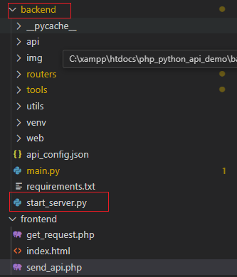

別的機器可透過 [http://192.168.1.111/php_python_api_demo/frontend/index.html](http://192.168.1.111/php_python_api_demo/frontend/index.html) 來訪問前臺


## 1. 前端 frontend 資料夾

展示測試平台的顯示邏輯

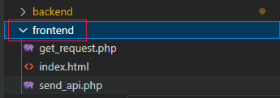

### file : index.html

主要負責展示測試後台的畫面

上半部為每個選項需要 show 出哪些欄位來選擇

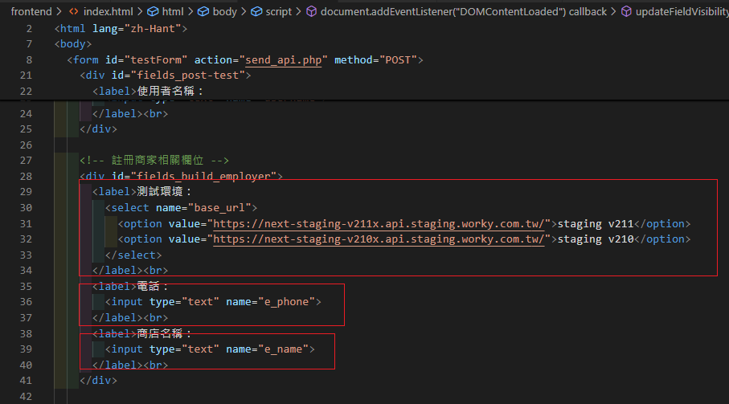

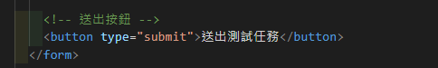

前端畫面如圖


下半部有一個簡單的檢查，判斷是否顯示欄位跟是否填寫完成

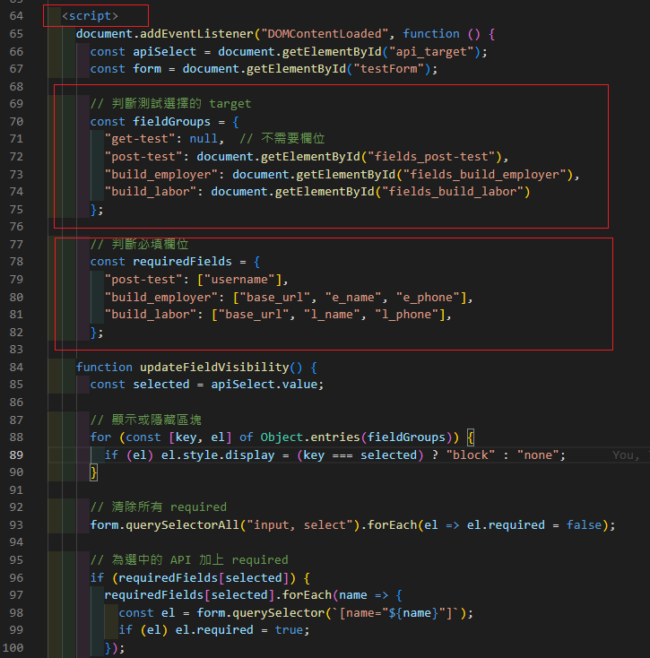

### file : get_request.php

用來將測試欄位跟測試邏輯分隔，主要編輯 method 是 post 的 API 需要的 body 欄位

以上述註冊商家為例，需要帶三個變數

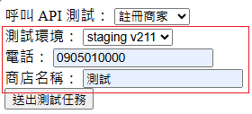

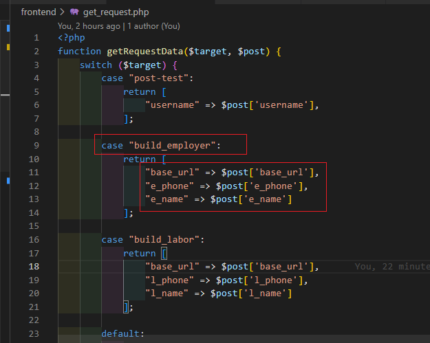

### file : send_api.php

1. 定義前台啟動的網域 192.168 來在內網啟動

2. 定義選擇的 api

3. 回傳的 response

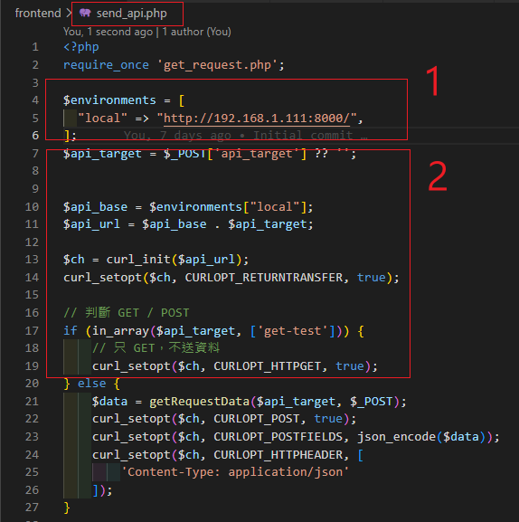

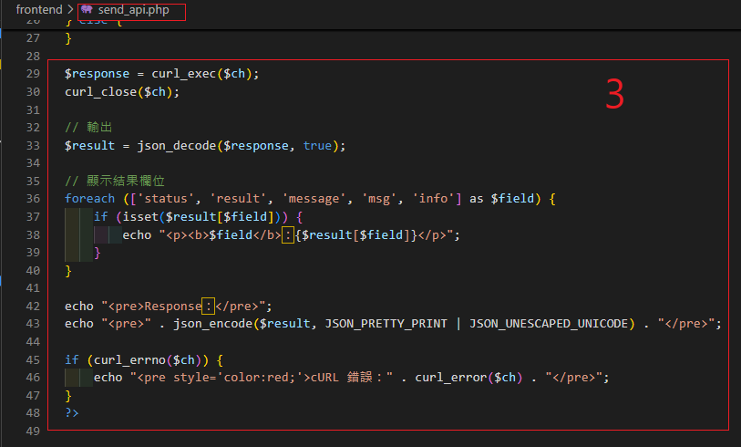

前台的輸出結果類似於這樣

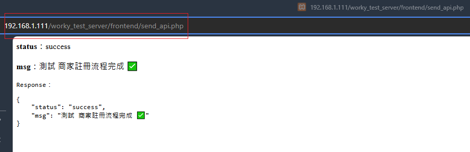


## 2. 後端 backend 資料夾

處理前端呼叫的 API，使用自己打包的 API (重新打包時要重啟 uvicorn)

```bash
cd backend
uvicorn main:app --host 0.0.0.0 --port 8000
```

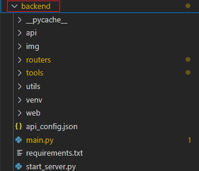

### file : main.py

用 fast api 打包，router 資料夾內的為打包的 function

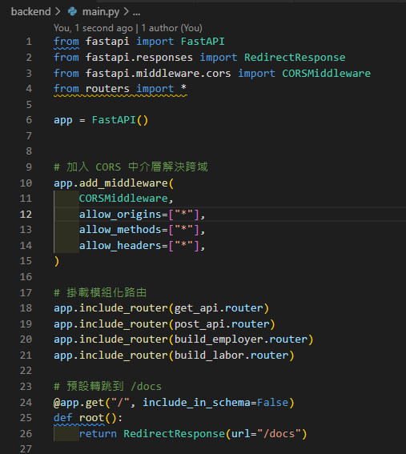

在 `backend`目錄底下啟動 `uvicorn main:app --host 0.0.0.0 --port 8000`
可以看到專案目錄須放在 xampp\htdocs\project 下方，會啟動一個 Apache 的 server

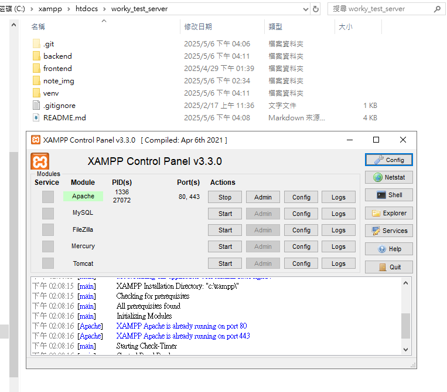

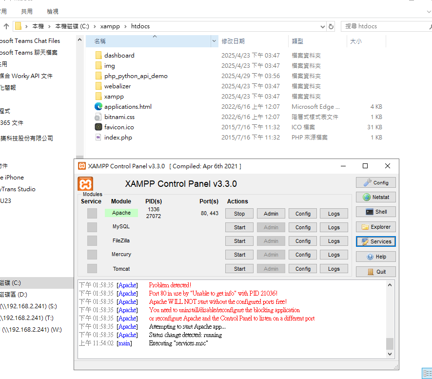

啟動 uvicorn 後可在同網段(或本地端)下查看，可快速測試自己包的 API

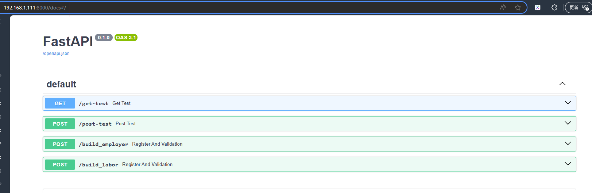

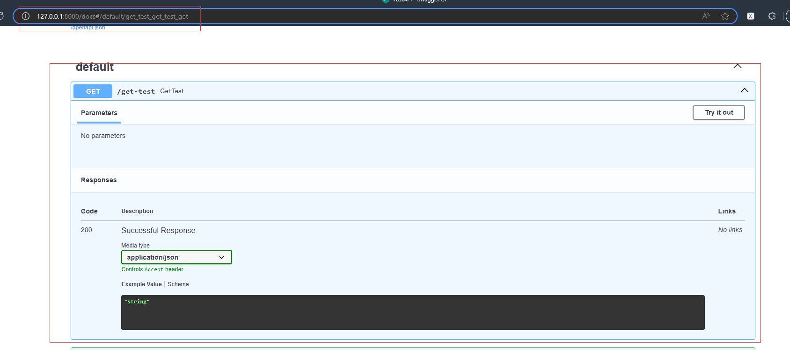

### file : routers/api.py

將 worky 內部用的 API 包成 fuction 用 fastapi 來快速打包

並且將測試會使用的欄位用 class 分隔測試資料跟測試邏輯

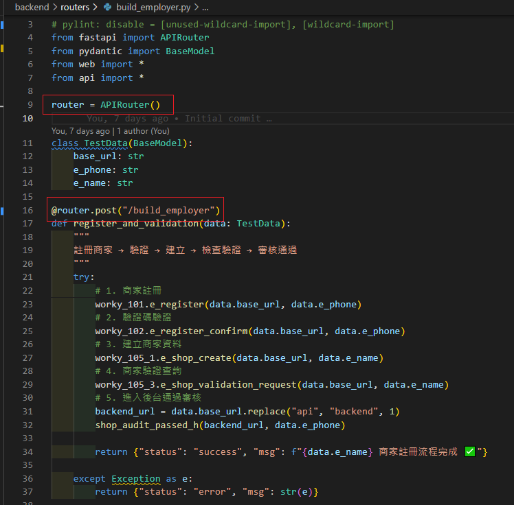

打包完後 include 到剛剛的 main.py 腳本內，重新啟動 uvicorn 就會看到測試用的 API

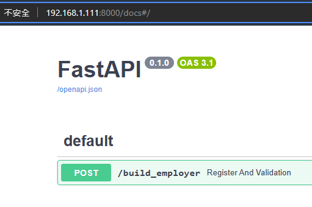


## 3. 下載 Apache

[Apache 下載位置](https://www.apachefriends.org/download.html)

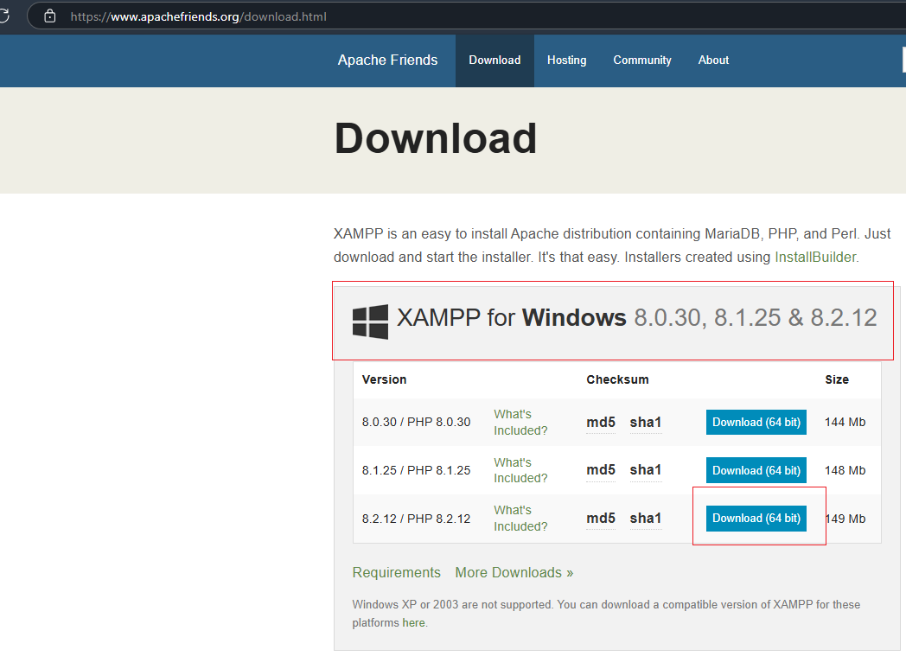

記下下載位置，例如我放在 C:/ 槽下

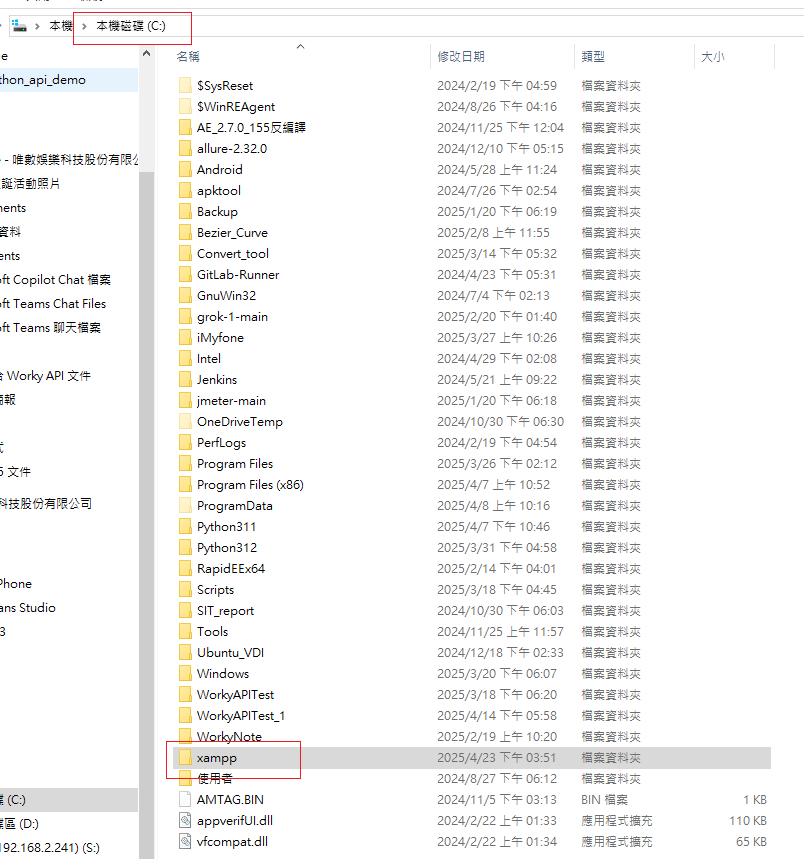

啟動 `xampp-control.exe`


## 4. 建立 python 環境

1. clone 專案

```bash
git clone http://122.147.190.35/SQATP/worky_test_server.git
```

並移動專案到剛剛下載的 `xampp\htdocs\project` 下，例如我的專案名叫 'php_python_api_demo'

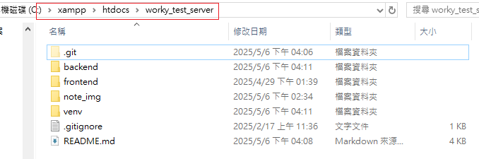


2. 啟動虛擬環境(也可以用 conda)

```bash
cd C:\xampp\htdocs\worky_test_server
python -m venv venv
venv\Scripts\activate
```

3. 下載依賴包

```bash
pip install -r requirements.txt
```

4. 啟動 uvicorn

```bash
uvicorn main:app --reload --host 0.0.0.0 --port 8000
```

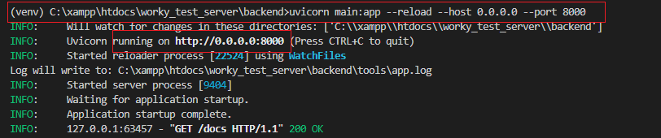

5. 啟動 socket io

```bash
uvicorn main:app --reload --host 0.0.0.0 --port 8000
```

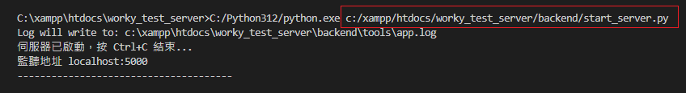